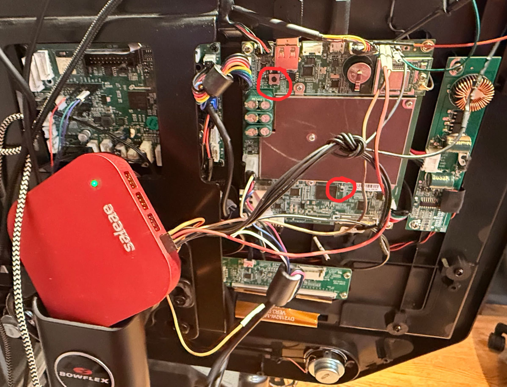

# velotool

A cross-platform USB flash tool for the **Bowflex VeloCore** indoor cycling bike, built around the Rockchip RK3399 SoC.

Reads, writes, and backs up eMMC partitions over USB using the Rockchip maskrom/loader protocol. The DDR loader binary is embedded — just plug in USB and go.

```
 ██╗   ██╗███████╗██╗      ██████╗ ████████╗ ██████╗  ██████╗ ██╗
 ██║   ██║██╔════╝██║     ██╔═══██╗╚══██╔══╝██╔═══██╗██╔═══██╗██║
 ██║   ██║█████╗  ██║     ██║   ██║   ██║   ██║   ██║██║   ██║██║
 ╚██╗ ██╔╝██╔══╝  ██║     ██║   ██║   ██║   ██║   ██║██║   ██║██║
  ╚████╔╝ ███████╗███████╗╚██████╔╝   ██║   ╚██████╔╝╚██████╔╝███████╗
   ╚═══╝  ╚══════╝╚══════╝ ╚═════╝    ╚═╝    ╚═════╝  ╚═════╝ ╚══════╝
```

## Why velotool?

The VeloCore runs Android 9 on an RK3399 with a 29 GB eMMC. Rockchip's official tools (`rkdeveloptool`, `rkflashtool`) work but require manual multi-step workflows, have no partition name resolution, no progress bars, and no backup capability. The VeloCore's loader also crashes on large reads, requiring careful chunking.

**velotool** solves all of this in a single binary:

- Embeds the DDR loader — no separate files needed
- Automatically detects maskrom mode and initializes the device
- Knows all 28 VeloCore partitions by name
- Chunked 64 KB transfers that don't crash the loader
- Full device backup with SHA-256 verification
- Flash profiles for common operations (root, stock restore)
- Progress bars with transfer rates
- Cross-platform: Linux (x86_64/ARM64), Windows, macOS

## Hardware

| Component | Details |
|-----------|---------|
| SoC | Rockchip RK3399 (dual Cortex-A72 + quad Cortex-A53) |
| RAM | 2 GB LPDDR3 |
| eMMC | 29.1 GB DA4032 (HS200) |
| Display | 1920x1080 eDP via PTN3460 bridge |
| WiFi | BCM43455 (AP6255) |
| Touch | ILITEK USB HID |
| Android | 9.0 (kernel 4.4.167) |

## Quick Start

### Prerequisites

- USB cable connected between the VeloCore board and your computer
- Device in **Maskrom mode** (hold recovery button, press reset, hold 5 seconds)
- On Windows: [WinUSB driver](https://zadig.akeo.ie/) installed via Zadig for the Rockchip device
- On Linux: `libusb-1.0` development headers (`apt install libusb-1.0-0-dev`)

### Install

Download a prebuilt binary from [Releases](../../releases), or build from source:

```bash
# Native build
make build

# Cross-compile for Raspberry Pi
make pi

# Build all platforms
make release
```

### Basic Usage

```bash
# Detect the device
velotool detect

# Read a partition
velotool read uboot_b uboot_backup.img

# Flash a partition
velotool flash uboot_b uboot_patched.img

# Full device backup
velotool backup ./my_backup/

# Reset (reboot) the device
velotool reset
```

## Commands

### `detect` — Find Device

Scans USB for Rockchip RK3399 devices and shows mode, bus address, and chip info.

```
$ velotool detect

  ✓ RK3399 (Maskrom)
  ┌──────────────────────────────────
  │  Mode     Maskrom
  │  USB      Bus 1, Address 5
  │  PID      0x330c
  └──────────────────────────────────
```

If the device is in Maskrom mode, velotool automatically downloads the embedded DDR loader before any read/write operation. No manual step required.

### `read` — Read Partition

Reads an eMMC partition to a local file.

```bash
# By partition name
velotool read vbmeta_b vbmeta_backup.img

# By raw LBA offset
velotool read --lba 0x6000 --sectors 8192 dump.img dummy
```

### `flash` — Write Partition

Writes a local image file to an eMMC partition. Validates file size against partition boundaries.

```bash
velotool flash uboot_b uboot_patched.img
velotool flash vbmeta_b vbmeta_stock_flags2.img -y   # skip confirmation
```

### `flash-all` — Multi-Partition Flash

Flashes a predefined set of partitions from a directory of image files.

```bash
velotool flash-all root-stack ./images/
velotool flash-all stock-restore ./stock_backup/ -y
```

**Available profiles:**

| Profile | Partitions | Description |
|---------|-----------|-------------|
| `root-stack` | uboot_a, uboot_b, system_b, vendor_b | Quick root (AVB skip + rooted system) |
| `stock-restore` | uboot_a, uboot_b, vbmeta_b, system_b, vendor_b | Full stock recovery |
| `full-root` | uboot_a, uboot_b, vbmeta_b, boot_b, system_b, vendor_b | Complete root with AVB disabled |

### `backup` — Full Device Backup

Dumps every partition to individual `.img` files with SHA-256 checksums.

```bash
velotool backup ./velocore_backup/
velotool backup ./velocore_backup/ --skip userdata              # skip 12 GB userdata
velotool backup ./velocore_backup/ --skip userdata,oem_a,oem_b  # skip multiple
```

Generates:
- Individual partition images (`uboot_a.img`, `system_b.img`, etc.)
- `manifest.json` — structured backup metadata with checksums
- `checksums.sha256` — standard checksum file for `sha256sum -c`

Checks free disk space before starting and refuses if there isn't enough room.

### `partitions` — Partition Table & Live Scan

Lists all 28 VeloCore partitions. When a device is connected, performs live analysis:

```bash
velotool partitions          # scan device + show table
velotool partitions --no-scan  # table only, no device needed
```

Live scan identifies:
- **Filesystem types**: ext4, F2FS, squashfs, Android sparse
- **Image formats**: AVB, Android boot, Rockchip loader, BL31 trust, FIT/DTB
- **Security**: LUKS encryption detection
- **Entropy analysis**: Shannon entropy per partition (detects encryption/compression)

### `reset` — Reboot Device

```bash
velotool reset
```

Triggers normal boot: BootROM → loader → U-Boot → Android.

## Partition Layout

The VeloCore has A/B partition slots, though it always boots from **Slot B** in practice. Slot A contains a vanilla Rockchip/Google system with no Nautilus apps — it exists as a fallback but the device never switches to it during normal operation.

| Partition | Start LBA | Size | Description |
|-----------|-----------|------|-------------|
| uboot_a | 0x4000 | 4 MB | U-Boot bootloader (slot A) |
| uboot_b | 0x6000 | 4 MB | U-Boot bootloader (slot B) |
| trust_a | 0x8000 | 4 MB | ARM Trusted Firmware (slot A) |
| trust_b | 0xa000 | 4 MB | ARM Trusted Firmware (slot B) |
| misc | 0xc000 | 4 MB | Bootloader control metadata |
| resource | 0xe000 | 16 MB | Boot logo / resources |
| kernel | 0x16000 | 32 MB | Linux kernel |
| dtb | 0x26000 | 4 MB | Device tree blob |
| dtbo_a | 0x28000 | 4 MB | Device tree overlay (slot A) |
| dtbo_b | 0x2a000 | 4 MB | Device tree overlay (slot B) |
| vbmeta_a | 0x2c000 | 1 MB | Android Verified Boot metadata (A) |
| vbmeta_b | 0x2c800 | 1 MB | Android Verified Boot metadata (B) |
| boot_a | 0x2d000 | 64 MB | Boot ramdisk (slot A) |
| boot_b | 0x4d000 | 64 MB | Boot ramdisk (slot B) |
| backup | 0x6d000 | 112 MB | Backup partition |
| security | 0xa5000 | 4 MB | Security data |
| cache | 0xa7000 | 512 MB | Android cache |
| system_a | 0x1a7000 | 2.5 GB | Android system (slot A) |
| system_b | 0x6a7000 | 2.5 GB | Android system (slot B) |
| metadata | 0xba7000 | 16 MB | Filesystem metadata |
| vendor_a | 0xbaf000 | 512 MB | Vendor partition (slot A) |
| vendor_b | 0xcaf000 | 512 MB | Vendor partition (slot B) |
| oem_a | 0xdaf000 | 512 MB | OEM partition (slot A) |
| oem_b | 0xeaf000 | 512 MB | OEM partition (slot B) |
| frp | 0xfaf000 | 512 KB | Factory Reset Protection |
| sw_release | 0xfaf400 | 1.9 GB | Software release |
| video | 0x1e86400 | 1.1 GB | Video firmware |
| userdata | 0x2304400 | 11.6 GB | User data (F2FS) |

## How It Works

### Boot Sequence

```
Power On → BootROM (maskrom) → idbloader → TF-A (trust) → U-Boot → kernel → Android
```

When the device is in **Maskrom mode** (recovery button held during reset), the BootROM exposes a USB interface that accepts control transfers. velotool uses this to:

1. **Send DDR init** (471) — initializes LPDDR3 memory via USB control transfers
2. **Send USB plug** (472) — loads the Rockchip USB handler into DRAM
3. **Bulk operations** — the USB plug accepts standard CBW/CSW commands for LBA read/write

This entire sequence happens automatically when you run any read/write command on a device in Maskrom mode.

### USB Protocol

velotool implements the Rockchip USB protocol:

- **Control transfers** for maskrom boot download (471/472 segments, 4 KB chunks, CRC-CCITT)
- **Bulk transfers** for LBA read/write (CBW/CSW framing, 64 KB chunks, 128 sectors per transaction)
- **Direct libusb** calls via CGo for reliable timeout handling

### Chunked Transfers

The VeloCore's Rockchip loader is known to crash on large USB transfers. velotool handles this with:

- 64 KB (128 sector) chunks per USB transaction
- Automatic retry (3 attempts per chunk)
- Progress reporting with transfer rates

## Building from Source

### Requirements

- Go 1.24+
- `libusb-1.0` development headers
- CGo-compatible C compiler

### Linux

```bash
sudo apt install libusb-1.0-0-dev
make build
```

### Raspberry Pi (cross-compile from x86)

```bash
sudo apt install gcc-aarch64-linux-gnu libusb-1.0-0-dev:arm64
make pi
```

Or build natively on the Pi:

```bash
sudo apt install libusb-1.0-0-dev
make build
```

### Windows

Requires [MSYS2](https://www.msys2.org/) or a MinGW toolchain with libusb headers:

```bash
make windows
```

The Rockchip device also needs the WinUSB driver installed via [Zadig](https://zadig.akeo.ie/).

### macOS

```bash
brew install libusb
make darwin
```

## Entering Maskrom Mode

To flash or read the VeloCore's eMMC, the RK3399 must be in **Maskrom mode**. This bypasses the normal boot chain and exposes a USB interface for direct eMMC access.

### What You Need

- A USB-A to USB-A cable (or USB-A to USB-C depending on your board revision)
- Access to the RK3399 board inside the bike's console housing
- A computer running velotool (Raspberry Pi works great for a dedicated flash station)

### Opening the Console

1. Power off the bike and unplug it
2. Remove the rear cover of the touchscreen console (4-6 screws depending on revision)
3. Locate the RK3399 board — it's the main board behind the display
4. Identify the **USB OTG port** (used for flashing) and the **reset/recovery buttons**

### Board Layout



The photo above shows the VeloCore's RK3399 board with the console cover removed. The **reset button** (top circle) and **recovery button** (bottom circle) are the two small tactile switches used to enter Maskrom mode.

### Entering Maskrom

1. **Connect USB** between the VeloCore's OTG port and your computer
2. **Hold the recovery button** (bottom circle in the photo above)
3. While still holding recovery, **press and release the reset button** (top circle), or plug in the bike's power
4. **Continue holding recovery for ~5 seconds**, then release
5. The board is now in Maskrom mode — the display will remain blank (no boot)

### Verify

```bash
$ velotool detect

  ✓ RK3399 (Maskrom)
  ┌──────────────────────────────────
  │  Mode     Maskrom
  │  USB      Bus 1, Address 5
  │  PID      0x330c
  └──────────────────────────────────
```

On Linux, you can also verify with `lsusb`:

```bash
$ lsusb | grep Rockchip
Bus 001 Device 005: ID 2207:330c Fuzhou Rockchip Electronics Company RK3399 in Mask ROM mode
```

### Tips

- If `velotool detect` shows nothing, try a different USB cable — some cables are charge-only
- On Linux, you may need `sudo` or a udev rule for USB access
- On Windows, install the **WinUSB** driver via [Zadig](https://zadig.akeo.ie/) for the "Rockchip" device
- If the device becomes unresponsive after a failed transfer, **unplug power completely**, wait 5 seconds, then repeat the Maskrom entry procedure
- A Raspberry Pi connected directly to the bike makes a great permanent flash station — SSH in and run velotool remotely

## Global Flags

| Flag | Description |
|------|-------------|
| `-v, --verbose` | Enable verbose USB protocol logging (shows every CBW/CSW, transfer sizes, endpoint info) |
| `-y, --yes` | Skip all confirmation prompts (for scripting) |

## Troubleshooting

### No device found
- Ensure the device is in Maskrom mode (see instructions above)
- Check USB cable connection
- On Linux: ensure you have permission to access USB devices (`sudo` or udev rules)
- On Windows: install WinUSB driver via Zadig

### Transfer errors
- Power cycle the device and re-enter Maskrom mode
- If the device becomes unresponsive ("wedged"), a full power cycle is required
- Use `-v` flag to see detailed USB protocol logging

### Build errors
- Ensure `libusb-1.0` development headers are installed
- Ensure CGo is enabled (`CGO_ENABLED=1`)
- Check that a C compiler is available (`gcc` or `cc`)

## Project Structure

```
velotool/
├── main.go                              # Entry point
├── cmd/
│   ├── root.go                          # CLI skeleton, auto loader download
│   ├── detect.go                        # USB device discovery
│   ├── read.go                          # Read partition to file
│   ├── flash.go                         # Write file to partition
│   ├── flash-all.go                     # Multi-partition flash profiles
│   ├── backup.go                        # Full device backup + checksums
│   ├── partitions.go                    # Partition table + live scan
│   ├── scan.go                          # Alias for partitions
│   ├── reset.go                         # Device reboot
│   ├── loader.bin                       # Embedded DDR loader (go:embed)
│   ├── diskspace_unix.go               # Free space check (Linux/macOS)
│   └── diskspace_windows.go            # Free space check (Windows)
├── pkg/
│   ├── rockusb/
│   │   ├── device.go                    # USB enumeration, open/close
│   │   ├── protocol.go                  # CBW/CSW, command opcodes
│   │   ├── loader.go                    # BOOT header parse, 471/472 download
│   │   ├── bulkio.go                    # Direct libusb via CGo
│   │   ├── transfer.go                  # Chunked LBA read/write + retry
│   │   ├── rc4.go                       # RC4 cipher (IDB block path)
│   │   └── errors.go                    # Typed errors
│   ├── gpt/
│   │   └── gpt.go                       # GPT header + entry parser
│   └── partitions/
│       └── velocore.go                  # Embedded partition table + profiles
├── assets/
│   └── rk3399_loader_v1.30.130.bin      # Rockchip DDR loader
├── Makefile                             # Cross-compilation targets
├── go.mod
└── go.sum
```

## License

MIT

## Links

- [Battle With Bytes](https://www.battlewithbytes.io) — project blog
- [Rockchip RK3399 TRM](https://opensource.rock-chips.com/wiki_RK3399) — technical reference
